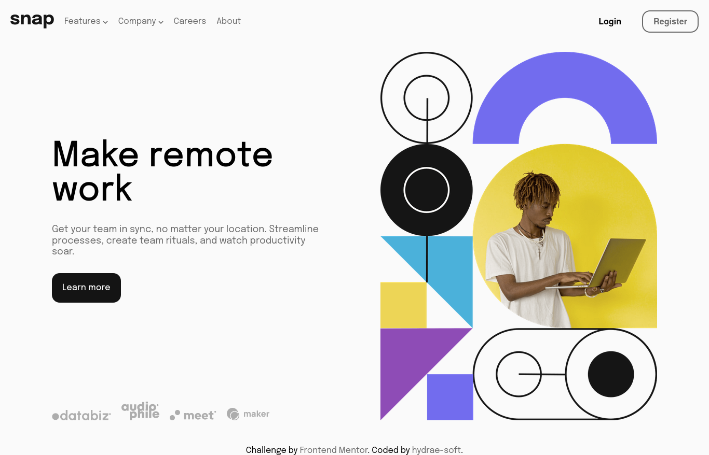
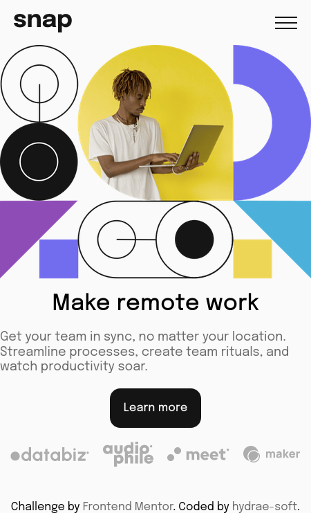
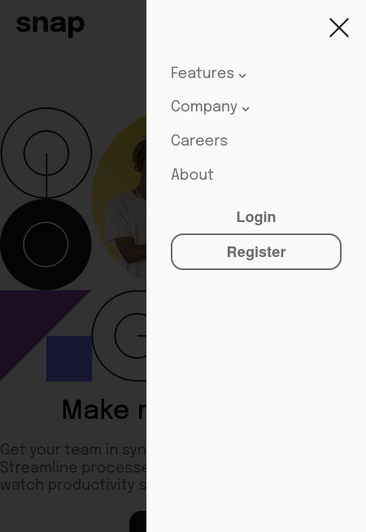

# Frontend Mentor - Intro section with dropdown navigation solution

This is a solution to the [Intro section with dropdown navigation challenge on Frontend Mentor](https://www.frontendmentor.io/challenges/intro-section-with-dropdown-navigation-ryaPetHE5). Frontend Mentor challenges help you improve your coding skills by building realistic projects. 

## Table of contents

- [Overview](#overview)
  - [The challenge](#the-challenge)
  - [Screenshots](#screenshots)
  - [Links](#links)
- [My process](#my-process)
  - [Built with](#built-with)
  - [What I learned](#what-i-learned)
  - [Continued development](#continued-development)
- [Author](#author)

## Overview

### The challenge

Users should be able to:

- View the relevant dropdown menus on desktop and mobile when interacting with the navigation links
- View the optimal layout for the content depending on their device's screen size
- See hover states for all interactive elements on the page

### Screenshots

### Links

- Solution URL: [https://github.com/hydrae-soft/FEM-intro-section-with-dropdown-navigation](https://github.com/hydrae-soft/FEM-intro-section-with-dropdown-navigation)
- Live Site URL: [https://hydrae-soft.github.io/FEM-intro-section-with-dropdown-navigation/](https://hydrae-soft.github.io/FEM-intro-section-with-dropdown-navigation/)

## My process

### Built with

- Semantic HTML5 markup
- CSS custom properties
- SASS
- Flexbox
- CSS Grid
- Mobile-first workflow

### Continued development

I think that I did a good work talking about HTML and CSS (more precisely in SASS), but I still have A LOT to learn from both and not to mention acquiring good practices.

Regarding to JavaScript, I am not sure if my code in this project is completely correct, but I have too much to learn of that too, even more than HTML and CSS.

## Author

- GitHub profile - [hydrae-soft](https://github.com/hydrae-soft)
- Frontend Mentor - [@Ludroid](https://www.frontendmentor.io/profile/Ludroid)